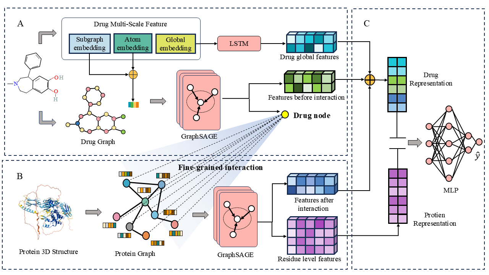

# FGAIM: Identifying Drug-Target Activation and Inhibition Mechanisms via Inductive Graph Neural Networks Based on Fine-Grained Interaction Strategies

## Overview
FGAIM is a framework for identifying drug-target activation and inhibition mechanisms using inductive graph neural networks. The method leverages fine-grained interaction strategies for more accurate modeling and predictions.The overall framework of FGAIM is illustrated in the figure below:


## Dependencies
To run this project, you will need the following Python packages:

- `numpy` == 1.20.3
- `rdkit` == 2023.9.6
- `networkx` == 2.6.3
- `pandas` == 1.3.4
- `torch` == 1.12.1
- `scikit-learn` == 0.24.2
- `scipy` == 1.7.1
- `tqdm` == 4.62.3

You can install these dependencies using `pip`:

```bash
pip install -r requirements.txt
```

## Datasets
This repository contains two benchmark datasets: **DrugAI** and **DTIAM**, which were collected from the respective research papers. The original dataset files can be found in the `./dataset/` directory.

## Feature Generation
Feature generation includes the extraction of multi-scale drug features and protein-related features. These features include:

- **DSSP features** for proteins
- **Atomic features** for molecules

You can find the code for feature generation in the `./feature/` directory.

## Training
To train a model, follow the steps below:

1. Navigate to the `./main/` directory
2. Run `./main/data_process.py` to remove source data and generate a Y-matrix for labeling activation/inhibition mechanisms
3. Run `./main/generate_contact_map.py` to generate contact maps for complete proteins
4. Execute the following command to start a **5-fold cross-validation** training run:

**Note**: The `./main/data_load.py` file is a critical component responsible for generating drug and protein graphs, as well as completing data encapsulation.

```bash
python 5flod_cross_valid_parallel_train.py
